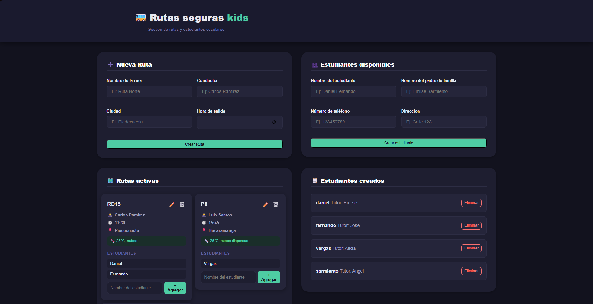
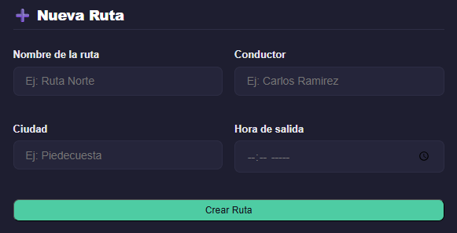
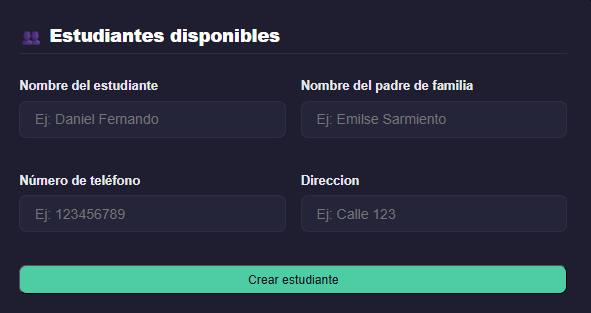
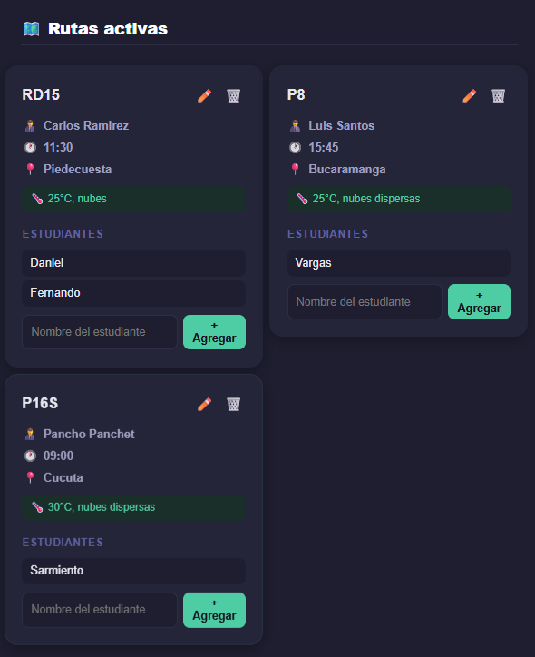
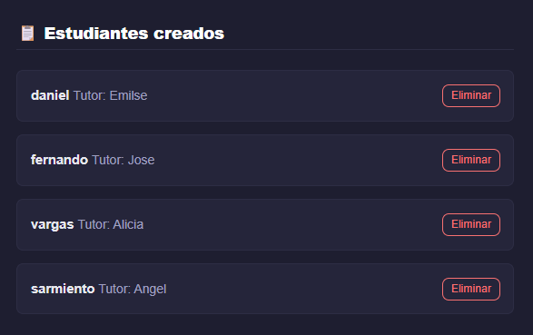
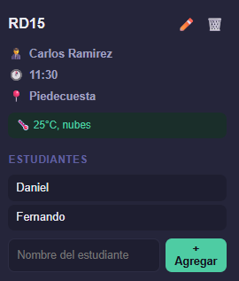
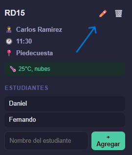
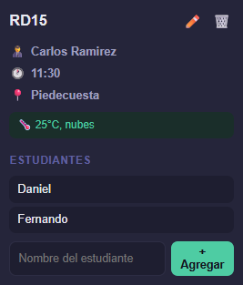
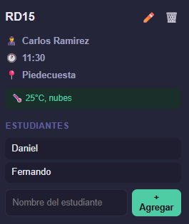

# 🚌 Rutas Seguras KIDS

Sistema web para la gestión de rutas escolares y asignación de estudiantes, desarrollado con HTML, CSS y JavaScript vanilla. Incluye consumo de API de clima en tiempo real.

## ✨ Características principales

- Gestión completa de **rutas** (crear, editar, eliminar).
- Gestión de **estudiantes** (crear, eliminar).
- Asignar estudiantes a una ruta específica.
- Eliminación en cascada: al eliminar un estudiante, desaparece de todas las rutas.
- Validación de formularios (campos obligatorios, formato de hora, teléfono mínimo 7 dígitos).
- Visualización del **clima actual** de la ciudad de cada ruta (usando OpenWeatherMap API).
- Diseño **responsive** con 3 breakpoints (móvil, tablet, escritorio).
- Persistencia de datos con `localStorage`.
- Web Component (`<route-card>`) con Shadow DOM y template reutilizable.

## 🛠️ Tecnologías utilizadas

- HTML5 semántico
- CSS3 (Flexbox, Grid, variables, media queries)
- JavaScript ES6+ (Vanilla)
- Web Components (Custom Elements, Shadow DOM)
- API de OpenWeatherMap
- localStorage

## 📦 Instalación y ejecución

1. Clona este repositorio:
   ```bash
   git clone https://github.com/dv1563927-star/Rutas-Seguras-KIDS.git
   ```

2. Abre la carpeta del proyecto.

3. Obtén una API key gratuita en [OpenWeatherMap](https://openweathermap.org/api) (registro sencillo).

4. En el archivo `js/api.js`, reemplaza `'TU_API_KEY_AQUI'` por tu clave:
   ```javascript
   const API_KEY = 'tu_clave_aqui';
   ```

5. Abre el archivo `index.html` en tu navegador preferido (Chrome, Firefox, Edge).

> No se requiere servidor web ni dependencias externas.

## 🖼️ Capturas de pantalla

A continuación se muestra el flujo de uso de la aplicación:

### 1. Página de inicio


*Interfaz principal con formularios de creación y listado de rutas y estudiantes.*

### 2. Creación de una ruta


*Completa los campos: nombre de la ruta, conductor, ciudad y hora de salida.*

### 3. Creación de un estudiante


*Registra al estudiante con nombre, tutor, teléfono y dirección.*

### 4. Listado de rutas creadas


*Cada ruta se muestra en una tarjeta individual con su información y estudiantes asignados.*

### 5. Listado de estudiantes disponibles


*Todos los estudiantes registrados aparecen aquí. Puedes eliminarlos con el botón correspondiente.*

### 6. Asignación de estudiante a una ruta


*Dentro de la tarjeta de ruta, escribe el nombre del estudiante (debe existir previamente) y haz clic en "+ Agregar".*

### 7. Edición de una ruta


*Haz clic en el lápiz (✏️) de la tarjeta para editar los datos de la ruta.*


*El formulario se llena con los datos actuales y el botón cambia a "Actualizar Ruta". Modifica los campos y guarda.*

### 8. Eliminación de una ruta


*El botón 🗑️ elimina la ruta completa (incluyendo sus estudiantes asignados).*

### 9. Visualización del clima


*Cada tarjeta muestra automáticamente el clima actual de la ciudad de la ruta (temperatura y descripción).*

### 10. Validación de formularios


*Si intentas enviar un formulario con campos vacíos o datos incorrectos (ej. teléfono con menos de 7 dígitos), se muestran mensajes de error.*

## 🧪 Prueba la aplicación

1. Crea al menos **dos rutas** y **tres estudiantes**.
2. Asigna estudiantes a las rutas.
3. Edita alguna ruta (cambia la ciudad y observa cómo se actualiza el clima).
4. Elimina un estudiante de la lista general y comprueba que desaparece de todas las rutas.
5. Reduce el tamaño de la ventana para ver el diseño responsive (móvil, tablet, escritorio).

## 📂 Estructura del proyecto

```
Rutas-Seguras-KIDS/
├── index.html
├── css/
│   └── style.css
├── js/
│   ├── api.js
│   ├── rutas.js
│   ├── main.js
│   └── componentes/
│       └── tarjetas-rutas.js
├── img/
│   └── (todas tus capturas)
└── README.md
```

## 👩‍💻 Autor

**Tu nombre** – [GitHub](https://github.com/dv1563927-star)

## 📄 Licencia

Proyecto educativo sin fines comerciales. Libre para ser utilizado como referencia en trabajos escolares.

---

¡Gracias por visitar este repositorio! Si tienes alguna sugerencia, no dudes en abrir un issue.